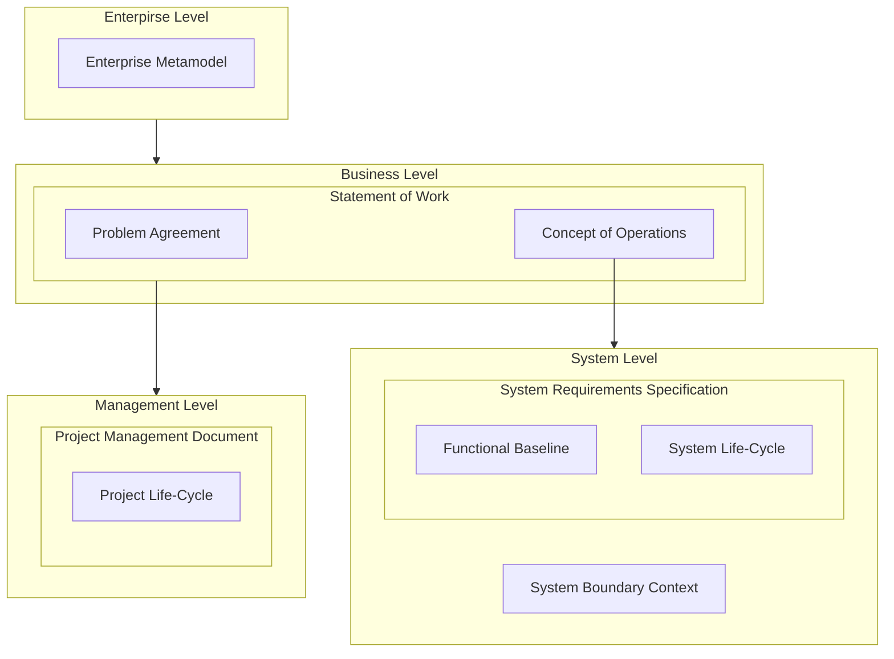

# Systems Engineering Documentation

## System Context

## Main Documents Context

## Enterprise Level

- [Enterprise Metamodel](../enterprise/architecture/Enterprise%20Metamodel.md)

## Business Level

- [Statement of Work](../enterprise/agreements/Statement%20of%20Work.md)
- [Concept of Operations](../engineering/Concept%20of%20Operations.md)

## System Level

- [System Requirements Specification](../engineering/specifications/System%20Requirements%20Specification.md):
	- [Functional Baseline](../engineering/Functional%20Baseline.md)
	- [System Life-Cycle](../engineering/System%20Life-Cycle.md)

## Level Management

- [Document Management](../management/document%20management/Document%20Management.md)
- [Project Management Document](../management/project%20management/Project%20Management%20Document.md)
	- [Project Life-Cycle](../management/project%20management/Project%20Life-Cycle.md)

## Catalogs

- [Metamodels Catalog](../engineering/catalogs/Metamodels%20Catalog.md)
