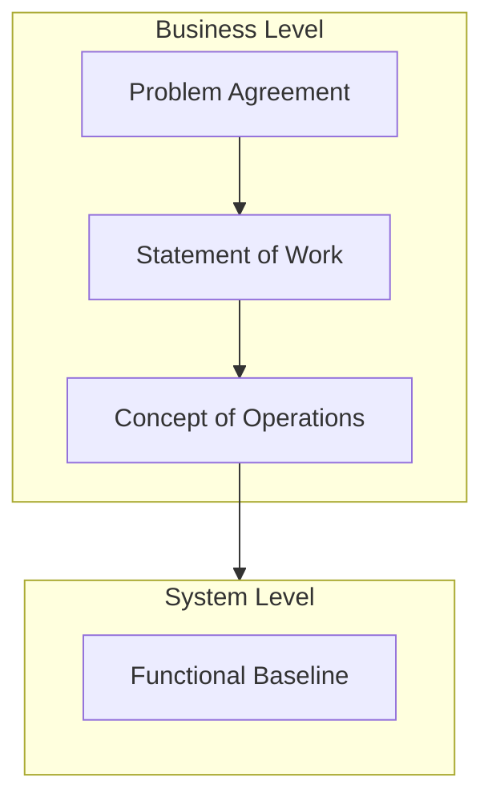

# Systems Engineering Documentation

## System Context

## Main Documents Hierarchy

## Catalogs

- [Metamodels Catalog](../engineering/catalogs/Metamodels%20Catalog.md)

## System Specification

### Specifications

- [Functional Baseline](../engineering/Functional%20Baseline.md)

### System Life-Cycle

[System Life-Cycle](../engineering/System%20Life-Cycle.md)

## Project Management

[Project Life-Cycle](../management/project%20management/Project%20Life-Cycle.md)

## Management

[Document Management](../management/document%20management/Document%20Management.md)
[Project Management Document](../management/project%20management/Project%20Management%20Document.md)
