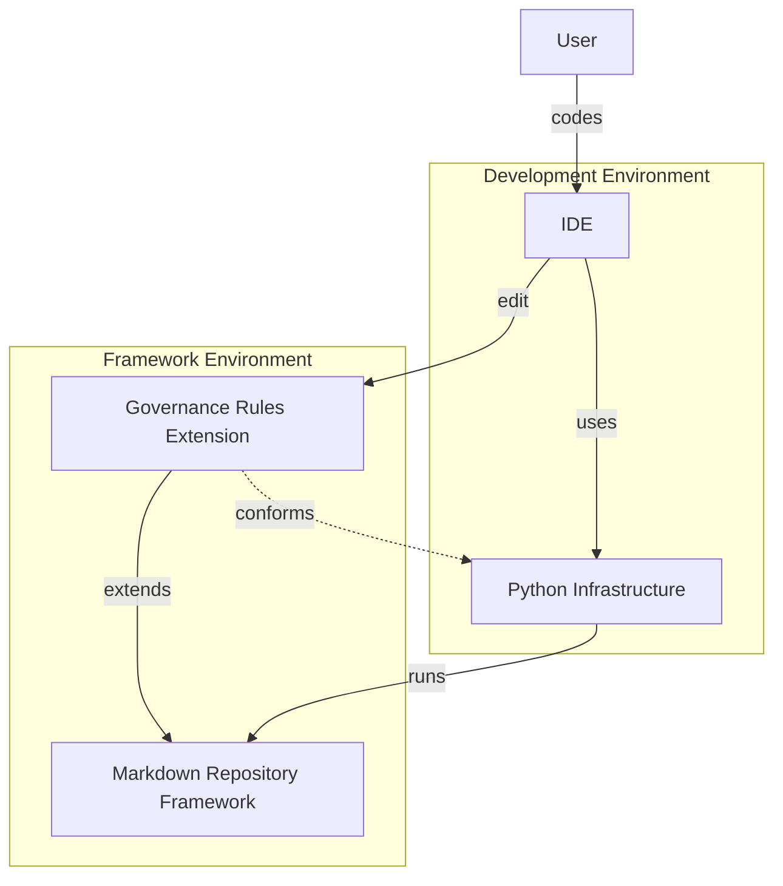

---
aliases:
---
# Concept of Operations

## Introduction

## System Purpose and Scope

This concept of operation have the purpose to  '*Acts as intermediate layer between the documents systems and the user to transparently apply governance rules and extract document information*' with the aim to transform and normalise Markdown documents.

The complete the system purpose and scope is defined in the [Statement of Work](../enterprise/agreements/Statement%20of%20Work.md) document, in their [System Purpose and Goals](../enterprise/agreements/Statement%20of%20Work.md#System%20Purpose%20and%20Goals) section.

## Stakeholders , Users and Actors

This concept of operation is intended to meet the following participant's needs:

- **Stakeholder:**
	- [Document Manager Persona](../enterprise/stakeholders/Document%20Manager%20Persona.md)
	- [Systems Engineer Persona](../enterprise/stakeholders/Systems%20Engineer%20Persona.md)
- **Users:**
	- [Markdown Editor Linux User Persona](../enterprise/stakeholders/Markdown%20Editor%20Linux%20User%20Persona/Markdown%20Editor%20Linux%20User%20Persona.md)
	- [Python Developer Persona](../enterprise/stakeholders/Python%20Developer%20Persona.md)

## System Context

Based in the [System Boundary Context](System%20Boundary%20Context.md) and their related metamodels, this this concept of operations is limited to the following:

- **Bounded Context**
	- Framework Environment
- **Actors:**
	- Python Programmer
- **Entities:**
	- Governance Rules Extension
	- Markdown Repository Framework
- **Metamodels**
	- [Markdown Document](System%20Boundary%20Context.md#Markdown%20Document)

<!--
Automation:
The 'To-Be' diagram with the unspecific elements as opaques must be automatically put here.
-->

The image below shows the elements selected in the system context.

## Operational Environment

The environment is presented the organisation in need to manage their Markdown documents. For then is assumed that:

- There is an organisation with many Markdown documents and systems:
	- The systems:
		- Depends and feed the Markdown documents.
	- The documents:
		- Need to conform a structural normative.
		- Need to support systems engineering processes
	- The 'Python Programmer' actor:
		- Uses 'Development Environments' (ak. VSCode) to interact with the 'Framework'

## Operational Scenarios

The concept of operation will operate in the 'Framework Environment' context, the 'Python Programmer' will use an 'Development Environments' with and IDE (ak. VSCode, PyCharm) with TDD infrastructure to develop and test the 'Governance Rules Extensions' as depicted below:

These operation will allow the user to interact and change Markdown documents , applying 'Governance Rules Extension' at will.

Once satisfied, the 'User' will store these 'Governance Rules Extensions' for further usage and ensure their quality with verification tests based in the TDD practices.

## Operational Goals

The operational goals are organised according to the [Problem Partitions](../enterprise/agreements/Problem%20Agreement.md#Problem%20Partitions) defined in the [Problem Agreement](../enterprise/agreements/Problem%20Agreement.md) document, under the [Stakeholders , Users and Actors](#Stakeholders%20,%20Users%20and%20Actors) perspective. 

For each partition, the goals are grouped into groups and then specialized according the '[Markdown Document](System%20Boundary%20Context.md#Markdown%20Document) ' metamodel defined in the [System Boundary Context](System%20Boundary%20Context.md) document.

A more specific description about these organisation levels can be found in the referenced documents.

### Governance Implementation

The system shall provide mechanisms to enforce structural integrity across the document repository. This includes metadata correction and the synchronisation of paragraphs/tables with authoritative external data sources, ensuring the "Source of Truth" is maintained.

For then, the users have the following goals:

1. *Document's Content Normalisation*
		1. **Content:**
				1. Normalise paragraphs and tables content based in other document's and systems changes.
				2. Convert textual section references into link section references.
		2. **Lists:**
				1. Convert list items into new documents , identifying these new documents and converting the items into links.

2. *Document's Metadata Normalisation*
	1. **Metadata:**
		1. Normalise the document's metadata containing the data and valid values required by the normalisation.
		2. Each documents that not contains an identification , receive an identification value.
		3. Each documents that not contains metadata , is applied 'Dublin Core' metadata.

3. **Document Validation:**

4. **Document Validation:**
	1. **References**
		1. Check if all links and images references links to a valid artefact.
	2. **Templates:**
		1. Check if a document conform to a Markdown document  or python logical structure template
5. **Engineering Information Process Support:**

### Information Integrity

No '*Information Integrity*' goals was defined

### Links Integrity

No '*links*' goals was defined

## Operational Capabilities

## Operational Characteristics and Qualities

Based in the 'system statement' and the stakeholders agreement the product will conforms the following characteristics based in the ISO-25010 and [Q42 Quality Model](https://quality.arc42.org/).

- **Adaptable**
	1. Git hooks can activate the product to apply the governance rules in changed documents.
	2. The product can be integrated into a document processing workflow.
	3. The product can interact with non-makdown based platforms as wiki using the same operations related to the Markdown documents.
	4. The system can convert Markdown documents from JSON.
	5. The system can read JSON documents and interact with it as a Markdown document.
- **Disposable**
- **Documented**
- **Efficient**
	1. The product must use near-zero human labor
	2. The product must be able to process a minimum 1000 documents using efficient memory usage.
- **Extensible**
	1. The product must get extensions from 'Pypi', 'Github' or other 'Git' based repositories.
	2. The user can define operation to transform documents
- **Flexible**
	1. The user can load python functions into the processing workflow to handle specific documents identified by their relative path in the repository or other document criteria.
- **Maintainable**
- **Managed**
- **Monitored**
	1. The product can sendo log information to a logging platform in an standardised format.
- **Observed**
	1. The user can follow the operations progress when running in terminal
- **Operable**
- **Reliable**
- **Safe**
	1. No document is lost due a software error.
	2. When a document is moved from a directory to another, all related links are updated.
	3. When a document is moved from a repository to another, all related attachments are moved together.
- **Secure**
	1. External extensions have no means to compromise the computing node where the product is running.
- **Suitable**
- **Usable**
	1. The product can change sections, titles, paragraphs and words styles (bold, italic)
	2. The product can change list and 'tasks lists'.
	3. The product can operate html tags.
	4. The product can operate document's tables.
	5. Some capabilities are avaliable as cli-application
	6. The user can build applications using the product.

### Efficiency and Performance

### Safety and Security

### Maintainability and Supportability

## Operational States

## Information Architecture

### Signals

### Inputs

### Outputs

### Data Objects

## Operational Scenario

### Aplicar Dublin Core

- **Trigger:**  O usuário possui uma série de documentos para aplicar operações básicas com os metadados Dublin Core.
- **Actors:** [Markdown Editor Linux User Persona](../enterprise/stakeholders/Markdown%20Editor%20Linux%20User%20Persona/Markdown%20Editor%20Linux%20User%20Persona.md)
- **Actor Objective:**
- **Business Value**
- **Pre-Conditions**
- **Pos-Conditions**
- **Main Flow:**
	- O usuário inicia a aplicação pelo terminal configurando para aplicar a goverança de Dublin Core
- **Alternative Flow:**
- **Success Criteria:**
	- A governaça básica do padrão Dublin Core foi aplicada corretamente a todos os documentos
- **Failures Modes:**
	- Corrupted Repository
- **Related Production Validation**

## Constraints

## Limitations

## Validation

### Governance Implementation

- **Document Normalisation**
	- **Metadata:**
		1. *Document's Metadata Normalisation*
			- **Measure of Performance:**
				1. Each document that not conforms the metadata normative must be transformed to conforms the metadata normative.
				2. Each document that contains any metadata, it receive 'Dublin Core' and an identification value
				3. Each document that contains 'Dublin Core' metadata but not an identification, receives an identification.
			- **Measures of Effectiveness:**
				1. Documents that conforms the normative must have no metadata changed.
			- **Acceptance Criteria:**
				1. All 'Measure of Performance' was archived.
	-  **Content:**
		1. *Document's Content Normalisation*
		2. *Document's Tables Operation*
			- **Measure of Performance**
				1. An entire table can be rebuild based in the external source information
				2. Any table cell information can be gathered and comparated to external source.
				3. Any table cell information can be updated to an external source.
			- **Measures of Effectiveness**
			- **Acceptance Criteria**
				1. All 'Measure of Performance' was archived.
		3. *Documents Links Operations*
			- **Measure of Performance**
				-  Any word between two 'Apostrophe' that is also an document section can be automatically converted to a link
				- Any word between two 'Apostrophe' that is also an document section from any referenced document can be automatically converted to a link
			- **Measures of Effectiveness**
			- **Acceptance Criteria**
	- **Lists:**
		- **Measure of Performance**
		- **Measures of Effectiveness**
		- **Acceptance Criteria**
			1. All 'Measure of Performance' was archived.
	1. 
## Engineering Information Process Support

