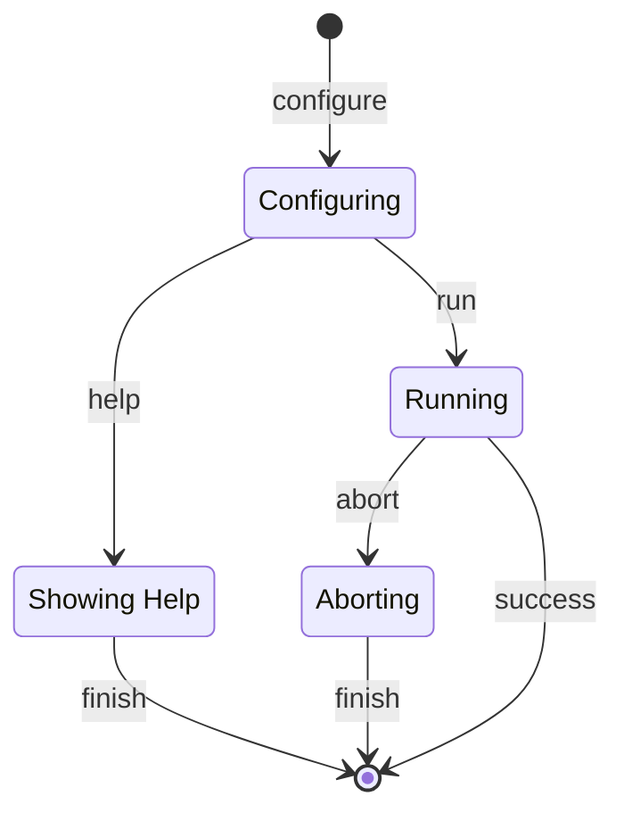

# Basic Bash Script Metamodel

## Identification

 - URI: metamodel:local.bash.basic/v1

## Description

This metamodel aims to standardise a common 'Bash Script' public interface and expected behaviour.

It's important to ensure every bash script have a predicted behaviour avoiding to accumulate technical debt or weakening the operations reliability.

For then the metamodel needs:

- Induce the script developer to adopt a common development workflow
- Make the script to respond with an standardised arguments and interrupting behaviour.
- Ensure each script follows the same basic validation.

For then the purpose is to:

- Provide a state machine model to induce the developer a common workflow
- Provide a tested scripting template that follows the expected argument and interrupting behaviour.
- Provide a testing infrastructure to ensure each new script follows the expected behaviour.

However due the problem nature that the script is target to solve, the metamodel should not be a burden for the script developer. That imposed to following limitation:

- To avoid add more complex controls, every execution should be verbose and controled by the user.

## Validations

The validations is implemented in the workflow

[operations-metamodels-validations](../../../support/workflows/operations/operations-metamodels-validations.Makefile)

## States

