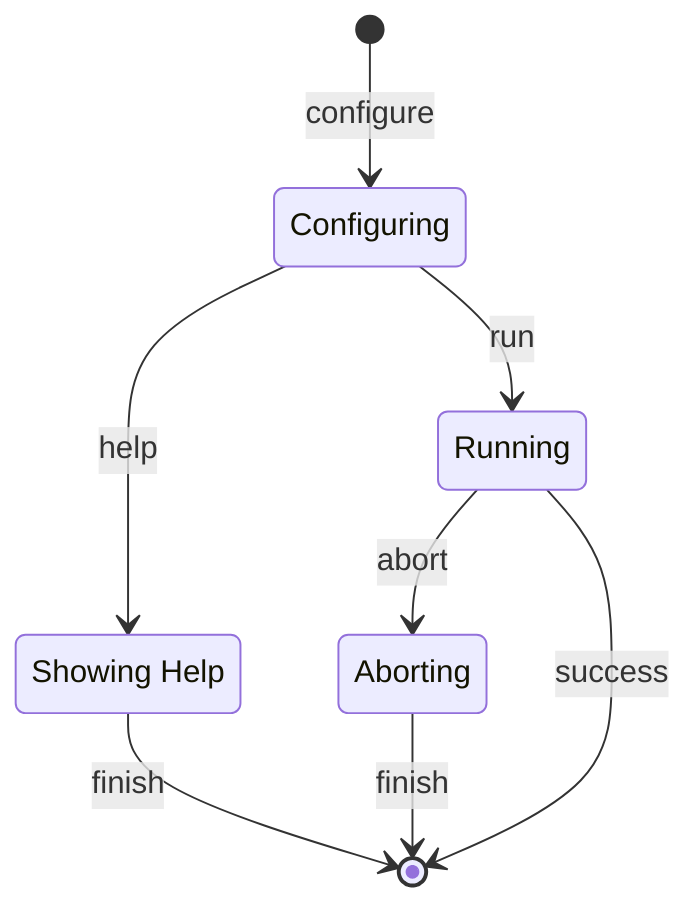

# Basic Bash Script Metamodel

## Identification

 - URI: metamodel:local.bash.basic/v1

## Description

## Validations

The validations is implemented in the workflow 

[operations-metamodels-validations](../../../support/workflows/operations/operations-metamodels-validations.Makefile)

## States

