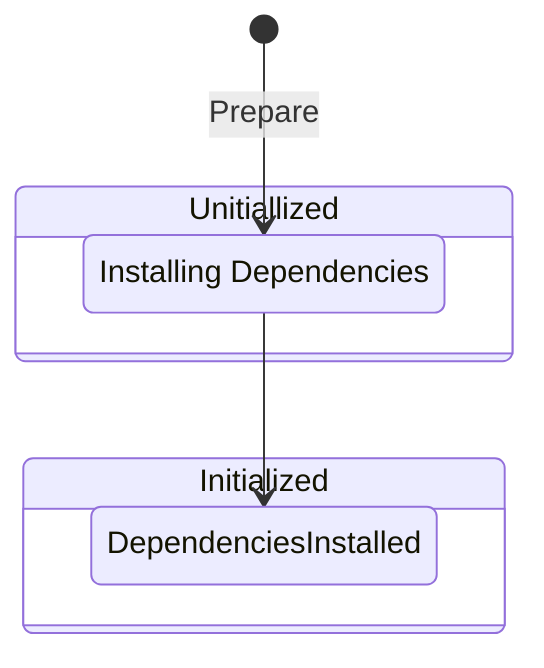

# Repository Management Workflow

## Identification

- URI: metamodel:local.repository.basic/v1

## Description

This model normalizes the repository management workflow, implemented in the [Makefile](../../../Makefile) workflow configuration.

## Validations

## States

