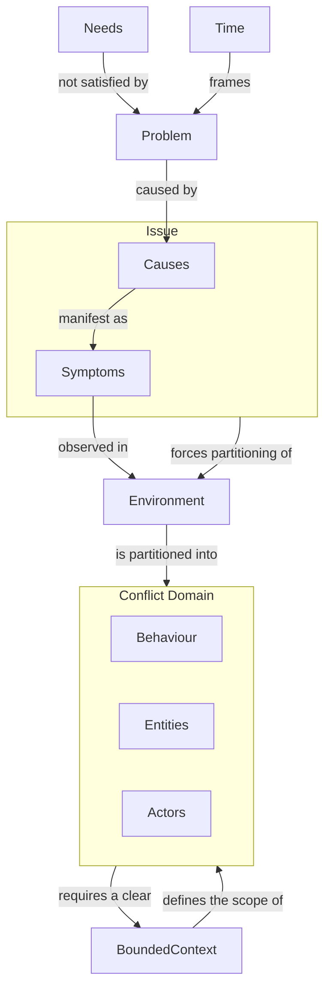

# Root Cause Analysis Metamodel

## Concerns

- **What is happening:**
	- What needs are not satisfied 
	- What's is the theory that  explains why the problem prevents the needs to be solved
- **What organisational elements are affected**
	- What are the related organisational behaviours
	- What are the related organisational entities
- **Where is happening:**
	- What is the environment where it's happening
	- When it's the problem is happening
- **The Bounded contexts:**
	- What are the bounded contexts in scenario
- **The Issues**
	- What is the relation between causes and their symptoms

## Metamodel

