# Problem Agreement

This document formalises the origins of problem that obstacule satisfy the needs of stakeholders.

The problem make difficult to keep the business and technical documents, and information systems information integrity, what degrades both customer experience and information systems quality.

This happens due the lack of organisational resources to keep these elements integrity required by the intensive manual work.

## Stakeholders

The following stakeholder agree about this problem:

- [Markdown Editor Linux User Persona](../stakeholders/Markdown%20Editor%20Linux%20User%20Persona/Markdown%20Editor%20Linux%20User%20Persona.md)
- [Python Developer Persona](../stakeholders/Python%20Developer%20Persona.md)

## Problem Partitions

To make more easily to read this document and manage the problem agreed, the problem was partitioned as below:

- **Governance Implementation:** The implementation and maintenance of the document governance rules 
- **Information Integrity:** The overall integrity e equivalency between documents and information systems.
- **Links Integrity:** The document's integrity to valid attachments and documents reference.

## Problem Origin

This document origin have the following unsatisfied needs from the referenced stakeholders:

- **Governance Implementation:**
	- Apply the document governance, ensuring metadata, content quality, and maturity verified.
- **Information Integrity:**
	- Keep business and technical documents, and information systems, with the same information independently their change origin.
- **Links Integrity:**
	- Preserve document links and attachment integrity when transferred to another their repository software, or when structural events changes as directory changes 

## Problem Statement

The amount of required resources to apply changes in documents is not affordable for the organisation.

## Problem Definition

The documents are one of main organisation assets used mainly  for coding information for operations, create a common shared shared among collaborators 
and other purposes. 

These documents are mainly coded in Markdown as raw-file in a file system, but can be transferred or incoming from other document based software as WikiJS.

Currently, the documents operations is made manually, what introduces mistakes and take too much time and resources to be fully completed. What is impossible for the organisation to sustain.

**Governance Implementation:**

As documents is an asset and to ensure  metadata and content quality maintenance. The governance rules must be continuous applied in effect to  documents or governance rules changes, or other external events 

Failing in apply the document's governance rules prevents the organization to apply operations that heavily depends in these documents.

**Information Integrity:**

The documents have as main audience the business and technical personal, and their information need be applied in and can be affected by information systems.

Change in business rules happens often , emerging the need to revise both business, technical and information to update these updates.

It's vital to keep both audiences, documents and information systems, updated and sharing the same information to create a common knowledge about the organisation state and operation.

Without these common knowledge the degradation starts for operations and information systems. Leading to a poor customer experience, increasing in collaborations frustration, information systems and general organisation degradation.

Also, the common knowledge make more easily to audit how these rules are effectively implemented in the organisation.

**Links Integrity:**

Documents operations as directory moving or documents title and name change are common. 

Due the Markdown static nature , any change in their file reference , name, attachment or other links are not automatically updated, leading to integrity link lost and possible making some document unreachable.

### Environment Description

The current environment is described in the diagram below , the document are dispersed in many 'Document Systems' that include mostly Markdown documents , but also can be LibreOffice and Google Drive documents.

The document's governance rules are changed by both 'Business Users' and the 'Document Management Persona', these governance rules are applied by the 'Manual Work' activity to keep the documents valid.

These work is made manually by both 'Document Management Persona' and document 'Writer'.

The result is the normalised document accessible to the 'Readers'

### Symptoms and Consequences 

In problem observed, the main symptoms found are: 

- For every changes or transfer, someone need to manually  find the related documents and information systems to apply these changes, aborting the processes if more changes come before finished the previous. 

As consequence:

- The information in documents and systems loose their integrity or are left obsolete  and mistes are made in the manual changes, resulting in need more changes need.

Alternatives to solve these issues as using documents baselines and scheduling updates after a considerable amount of business rules changes was proven inefficient because it accumulate so much changes to be manually done and locks the organisation operations.

The section below details the observations.

**Governance Implementation:**

1. Every time governance rules or an information is change, someone need to manually find the related documents and information systems, and manually apply these changes.
	1. As consequence:
		1. These changes also introduces  mistakes that will require further changes and spend more organisation's resources.
		2. The time and effort to apply these changes increases out-of-control due the growing documents number.
		3. There is no a mature document management in the organisation, and simple operations as keep the documents conformant  with a template is not possible, that contributes to degrade the organisation operations.
	2. Triggers:
		1. When a governance rules or an information change.
	3. Issues:
		1. Keeping the document conformant to their governance rules

**Information Integrity:**

1. Before the last business rules changes are completed , more  business rules changes arrive. That forces the manual work to abandon the previous changes updates to start the new ones.
	1. As consequence:
		1. Documents and information systems are left with obsolete information and the customer experience and the general organisation operations degrades.
		2. With degraded documents and information systems states make impossible to create a common knowledge in the organisation
		3. Audit almost declare that the business rules was not effective implemented due the lack of implementation evidence.
	2. Triggers:
		1. When business rules changes
	3. Issues:
		1. Apply all business rules changes without abandon it.

**Links Integrity:**

1. When a document directory changes, or the document needs to be transferred to another repository software, mostly of the links curation and files attachment transfer need be manually made.
	1. As consequence:
		1. It became a huge work  unsustainable for the organisation and poorly executed due their complexity leading to artefacts losses or documents link integrity losses.
	2. Triggers:
		1. When an link element is changed
		2. When a document is transferred from or to another repository software.
	3. Issues:
		1. Transfer documents to another repository software without loose their integrity
		2. Change the link elements without lost the document integrity.

### Problem Diagnosis

The root cause discovered is that for each major change in the documents require more resources than is available in organisation to  complete safety due the increasing required manual work for each change.
