# Statement of Work

## Context Diagram

## System Statement

**System Vision:**

The user are satisfied, both readers and editors, because readers can get updated documentation and editors can use their specialised tools to write the documentation.

The system acts as and intermediate layer between document systems and the users, applying governance rule transparently at each document change or when an specific event trigger the governance application.

Also, thanks their capabilities to act as a platform for document-based information integration and document generation, both business and technical team work seamless, the [Document Manager Persona](../stakeholders/Document%20Manager%20Persona.md) integrated workflows in the organisation pipelines that capture information from the documents. These captured information automatically updates systems and other documents.

The opposite also occurs when business rules change in external systems or sources; in this case, the pipelines activate the system that ensures the documents reflect these changes.

Documents then become a source of truth where accurate information is made available to the entire organization, as well as serving as an interface for uploading and publishing information.

Therefore, all markdown documents are now managed in many systems , each system contribute with their functional advantages. Some systems have no Markdown support, and no system contains the governance tools to keep all documents normalised by their own.

But there is no problem, the framework can connect to each one , apply the same governance rules and even transfer documents from one system to another.

The document integrity is guarantee to be preserved where a document is moved from one system to another, or when is moved from a directory to another. Because the framework update and transfer the document's links and  attachments.

We use the framework's abstraction called 'Repository' to handle the different systems as all be the same, so no matter in what system the document is stored or if have full Markdown features support, we all talk to manage a  'Repository' abstraction.

This allow the same governance rules to be applied to all systems, ensuring conformance across all systems.

Terminal users can interact with the framework with a cli terminal application , that is deployed as standard with the framework to realize some queries or apply some standard governance policies as the 'Dublin Core' metadata usage that  is deployed with the framework.

Applications can be made using the framework, enabling more tools for the users to handle the repositories.

Onde of these applications allow to use the documents  as 'source-of-truth' for both business and technical personal. As the framework can extract and update content from documents.

This allowed to create applications that extract content from the repositories, the save the result in JSON to be used for other applications.

Other applications keep the documents always updated, gathering data from external sources and updating the document's content and tables.
 
 As the framework can be extended as needed,  Python Programmers can code internal organisation document's policies in extensions, and deploy to be available the framework is activated by an external document governance pipeline.

The 'governance pipeline' is an external system, that activate the framework when needed to ensure each documentation baseline conform the governance, significantly reducing manual governance effort through a continuous, automated compliance pipeline.

And when the organisation policy changes, there is no problem, the Python Programmer releases a new update for the extension and the governance pipeline can update the documents again.

**Problem Definition:**

<!--
automation:
This section should be auto-generated based in the 'Problem Agreement' document.
-->

The problem is based in the need to keep the need to automate the documents checking and governance and to keep the business and technical personal at 'same page' using documents.

A more detailed explanations exists in the document [Problem Agreement](Problem%20Agreement.md).

**System Mission:**

Continue to apply the document's governance and keep both business and technical documents relevant for their audience, with an automated product that uses near-zero human labor.

**System Purpose and Goals:**

In order to satisfy the system mission outcome, the system have the following purpose and their goals described as subitems:

1. Acts as intermediate layer between the documents systems and the users that transparently apply governance rules and extract document information
	1. Transform non-normalised documents into normalised documents

2. Acts as a platform for document-based information integration and document generation.
	1. Convert unstructured content from documents into semi or structured content.
	2. Execute document transformation operations.

## Scope

### Stakeholders

### Principles

- [Lean Project Management](https://en.wikipedia.org/wiki/Lean_project_management)

### Constraints

- **Niche market:** The framework is not intended to satisfy a widely document management market , but it's to focus in Python platform and Markdown document processing users.

### Limitations

- **The project must be published as an open-source product the [GPL 3](https://www.gnu.org/licenses/gpl-3.0.en.html):** This ensure that derived works will follows the same license , make more easily for the community to get the source product.
- **The project must be made in Python Programming Language:** To offer the framework for the Python Programming language market.

### Assumptions

- **No great difficulty for software development:** Is not expected that the software development be challenged, because the basic Python libraries for Markdown document manipulation and generation yet exists and are mature.

### Uncertainties

- **No time to end:** There is no certainties about the cost development and time required for the framework to reach maturity.

## Goals

  - Develop the framework concept and design to support the [Concept of Operations](../../engineering/Concept%20of%20Operations.md).
  - Produce a product that support the operations described in the [Concept of Operations](../../engineering/Concept%20of%20Operations.md).
  - Implement the product to transform the current situation described in the  [As-Is Diagram](../../engineering/As-Is%20Diagram.md) to the situation described in the [Context Diagram](../../engineering/Context%20Diagram.md).
  - Publish the framework as an Open-Source Python Package in Pypi.

## Expected Outcome

### Enterprise Outcome

- The metadata governance applied with near zero human effort
- The main organisation documents and business rules integrated wit near zero human effort.
- Get relation with the open-source community due the framework open-source publication.

### Return of Investments

With the documents integrated using near zero human effort the enterprise alignment with all teams must increase assertiveness and reduce costs due the misalignment and tactical mistakes.

With the assertiveness increase and the documents integration, decision and changes in business rules could be made with less effort or updated in few minutes instead hours, enabling better agility.

With better agility will be possible to dedicate resources to more high value initiatives.

## Project Deliverables and Acceptance

### Major Deliverables

All major deliverables must be made in the Pypi platform.

- **Release 0.0.1:** The framework with the feature to open user file-system directories as repositories.
- **Release 0.1.0:** The framework with the feature to automatically apply standard 'Dublin Core' metadata policies.
- **Release 1.0.0:** The framework completely supporting the [Concept of Operations](../../engineering/Concept%20of%20Operations.md)  and acceptance criteria validated.

### Critical Milestones

The initial milestones date starts  with this project approval:

- **D+30:** The Release 0.0.1 published in PyPi.

### Acceptance Criteria

- **Functional:**
	- {Criteria}
- **Performance:**
	- {Criteria}
- **Operational**
	- {Criteria}

## Governance

{An high level declaration of the expected governance }

### Governance Structure

### Change Governance

### Risk Governance

## Management

{An high level declaration of the expected management }

### Project Management

{A simple project management introduction, with their 'project life-cycle' brief explanation and the main project management document reference}

- {Project Life-Cycle}
- {Project Management Main Document}

### Communication

{A brief communication plan explanation, with the document reference}

### Technical Management Areas

{A brief reference to other more technical management areas that could be in interest as listed below}

- **Configuration Management:**
- **Operations Management:**
-  **Maintenance and System Monitoring:**
-  **Security Management:**
-  **Knowledge Management:**
- - **Document Management:**

## Validations

- **Expected Outcome:**  
  - {Outcome}
  - **Success Criteria:**
    - {Success criteria}
  - **Measures of Effectiveness**
    - {Effectiveness criteria}
  - **Failure Criteria:**
    - {Failure criteria}

