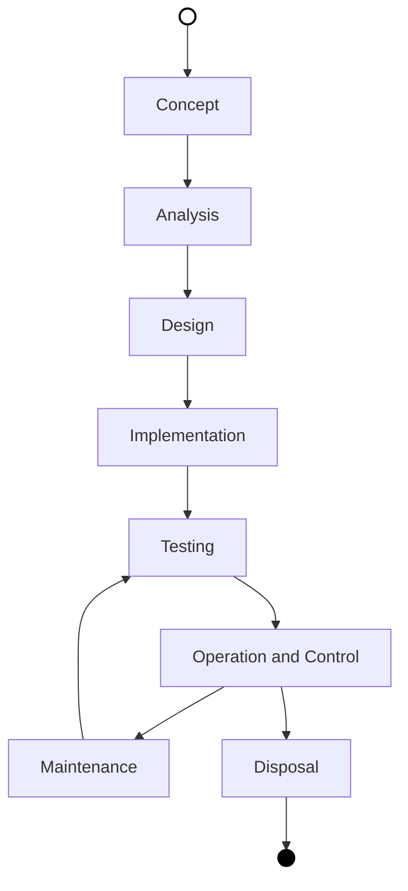

# Project Life-Cycle

## Description

This document specifies the project life-cycle specification, it's used to organise the processes in the project management.

It's different from the [System Life-Cycle](System%20Life-Cycle.md) because it's not about the system operation, but about this project.

## Diagram

The graph below describes the  life-cycle, their concept follow the main systems engineering life-cycle concepts , however **these life-cycle should not be interpreted as cascade model**. But rather an incremental an interactive model.

More details how to handle the life-cycle aren't specified here because it need to be tailored for each usage.

## Course of Actions

### Concept
  
**Purpose**

**Goals and Objectives**

- [x] Ter o projeto organizado para sua execução
- [x] Ter um conceito do que a proposta de solução irá atingir

**Actions**

- [x] Organize the project structure
- [x] Organize the problem specification for the solution proposal

**Deliverables**

- [x] The project structure
- [x] Specifications for the solution proposal development

### Development

**Purpose**

**Goals and Objectives**

- [x] Transformar a especificação da proposta de solução em um storytelling

**Actions**

- [x] Transformar a proposta de solução em uma storytelling.

**Deliverables**

- Os artefatos em fase de desenvolvimento:
  - [ ] {Artefato}

### Review

**Purpose**

**Goals and Objectives**

- [x] Garantir a conformidade dos artefatos com as especificações

**Action**

- [x] Revisar os artefatos para verificar a conformidade com as especificações

**Deliverables**

### Production

**Purpose**

**Goals and Objectives**

- [x] Produzir a versão final para ser entregue

**Actions**

- [x] {Action}
- [x] Revisar antes de enviado para operação

**Deliverables**

### Operation

**Purpose**

**Goals and Objectives**

**Actions**

**Deliverables**

### Maintenance

**Purpose**

**Goals and Objectives**

**Actions**

**Deliverables**

### Disposal

**Purpose**

**Goals and Objectives**

- [x] Garantir que o projeto esteja arquivado para consulta e uso futuro

**Actions**

- [x] Reduzir espaço no produto diretório de projeto
  - [x] Remover o diretório  '*.git*'
- [x] Compactar o projeto em um único arquivo
- [x] Gerar o código de 'checksum' do arquivo compactado
- [x] Entregar o projeto no arquivo compactado junto com o arquivo checksum

**Deliverables**

- [x] O projeto armazenado em um arquivo comprimido
- [x] O Checksum do arquivo comprimido

