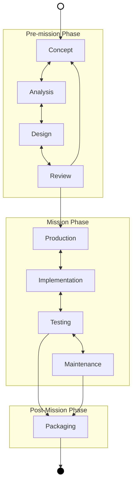

# Project Life-Cycle

## Description

This document specifies the project life-cycle specification, it's used to organise the processes in the project management.

It's different from the [System Life-Cycle](System%20Life-Cycle.md) because it's not about the system operation, but about this project.

## Diagram

The graph below describes the  life-cycle, their concept follow the main systems engineering life-cycle concepts , however **these life-cycle should not be interpreted as cascade model**. But rather an incremental an interactive model.

More details how to handle the life-cycle aren't specified here because it need to be tailored for each usage.

## Course of Actions

### Concept

Transform the stakeholder expectations into the formal documents that materialize the stakeholder agreement about their needs, the problem to be solved and space-solution.

**Actions**

- Execute the [Information Processing Systems Life-Cycle Value Stream](../../enterprise/value%20stream/main%20value%20stream/Information%20Processing%20Systems%20Life-Cycle%20Value%20Stream.md)

**Deliverables**

- [Statement of Work](../../enterprise/agreements/Statement%20of%20Work.md)
- [Concept of Operations](../../engineering/Concept%20of%20Operations.md)
- Functional Baseline

### Analysis

**Actions**
**Deliverables**

-

### Design

**Actions**
**Deliverables**

- Allocated Baseline
- Product Baseline

### Review

**Actions**
**Deliverables**

### Production

**Actions**
**Deliverables**

- Release 0.0.1
- The published release 0.0.1 in the 'PyPi' repository

### Implementation

**Actions**

**Deliverables**

- [Minimal Markdown Governance Application](deliverables/Minimal%20Markdown%20Governance%20Application.md)

### Testing

**Actions**
**Deliverables**

- Release 0.1.0

### Maintenance

**Actions**
**Deliverables**

- Release 1.0.0
- [Full Markdown Governance Application](deliverables/Full%20Markdown%20Governance%20Application.md)

### Packaging

**Actions**
**Deliverables**

- The full project and product packed for the application life-cycle management.
